

# Epochtalk Design System
The Epochtalk Design System provides a set of product design principles and guidelines that help build a cohesive user experience. 

We are starting the system with documentation and guidelines for all interface elements in the new Epochtalk experience. Future iterations of the system will include working code and design resources.

# Core
The smallest building blocks of the design system.

## Colors
Colors were chosen to emphasize actionable elements, while allowing the forum content to remain highly visible–since text and images are the most important elements on a discussion forum. 

The initial color theme for Epochtalk was chosen for maximum legibility. The white background with dark gray text allows for best readability. Orange is used at the primary highlight color to allow high visibility (contrast with the background and body text) without being obtrusive.

Several shades of the body color (gray) are used to de-emphasize secondary content, as well as to delineate elements (sections, panels, cards, etc).

| Color | Value | Variable |
| :---- | :---- | :------- |
| Background color: |	#FFFFFF	|	$color-bg |
| Background highlight color: |	#F5F5F5	|	$color-bg--highlight |
| Shadow color: |	4px 16px 8px rgba(0, 0, 0, 0.1)	| $color-shadow |
| Body color:	|	rgb(34, 34, 54)	|	$color-body |
| Secondary font color: |	rgb(153, 153, 153) | $color-body--secondary |
| Primary color: | rgb(255, 200, 0) | $color-primary |
| Secondary color: |  |  |
| Alert color: | rgb(202, 0, 0)	| $color-alert |
| Warning color: | rgb(255, 100, 0)	| $color-warning |

## Type
Epochtalk now uses Roboto as the primary font. Roboto was chosen for increased legibility and information density. Roboto is a modern, humanist sans serif font designed specifically for legibility on mobile screens. We can maintain high information density by tightening the line-height of the content, and using smaller font sizes while also keeping legibility high.

Roboto is used for all body text, highlight text and headers.

Font families
* Body: **Roboto (show example)**

### Font Sizes
Font sizes were chosen to maintain legibility of the main content (post body), allow differentiation between header / heading text, and allow de-emphasis of secondary text.

| Name | Size |
| :--- | :--- |
| Base / Body font size: | 16px |
| Heading 1: | 44px (2.75rem) |
| Heading 2: | 37px (2.3125rem) |
| Heading 3: | 24px (1.5rem) |
| Heading 4: | 21px (1.3125rem) |
| Heading 5: | -- |
| Small text:	| 14px (0.875rem) |
| Extra small / caption text: | 12px (0.75rem) |

### Line Height
Line height has been selected for increased information density. We selected this value to maintain legibility while allowing more text to be displayed in a given space. 

**Base line-height: 1.3**

### Formatted Text
#### Quotes
(insert image)
Quoted text is indented from the starting edge of the content (left edge on left-to-right languages). The indented text block has a light-gray line along its left edge to help differentiate it from body text. Quoted text is also shown in the secondary font color.

#### Code
(insert image)
`Code blocks` are shown in a block separated from the body text. The code block uses a light gray background and is rendered in the Consolas monospaced font. Code blocks appear in a single line. If the code exceeds the width of the post area, the block can be scrolled horizontally.

## Icons
Icons help users complete their tasks. They represent available actions or the current states of an element .

Icon forms should be simple and easy to understand. Avoid abstract icons. Avoid using ambiguous (or counterintuitive) icons. For clarity, icons should be paired with text whenever possible.

### Icon sizes
The base icon size is 16px (equivalent to the body font size). Icons should be sized according to the text they accompany–icons shown alongside smaller text labels should be downsized to match the text.

Icons can be used in larger sizes when an action or state requires more emphasis.

Epochtalk's icons are transitioning from a custom icon font to SVG. The SVG icons are more flexible, maintainable and faster  than the icon font (learn more about SVG icons). 

Icons:
(insert icons here)

  

    
    Add
  

  

    
    Add (filled)
  

  

    
    Admin
  

  

    
    Admin (circle)
  

  

    
    Alarm
  

  

    
    Back
  

  

    
    Ban
  

  

    
    Caret
  

  

    
    Chart
  

  

    
    Close
  

  

    
    Close (circle)
  

  

    
    Completed
  

  

    
    Completed (circle)
  

  

    
    Delete
  

  

    
    Drag
  

  

    
    Edit
  

  

    
    Expand
  

  

    
    Expand
  

  

    
    Forward
  

  

    
    Like
  

  

    
    Help
  

  

    
    Help (circle)
  

  

    
    Hot
  

  

    
    Hotter
  

  

    
    Image
  

  

    
    Image (wide)
  

  

    
    Link
  

  

    
    Locked
  

  

    
    Mentions
  

  

    
    Message
  

  

    
    Minimize
  

  

    
    Moderator
  

  

    
    Pin
  

  

    
    Plus One
  

  

    
    Poll
  

  

    
    Quote
  

  

    
    Reset
  

  

    
    Return
  

  

    
    Search
  

  

    
    Search Members
  

  

    
    Settings
  

  

    
    Star
  

  

    
    Status
  

  

    
    Unlocked
  

  

    
    Unwatch
  

  

    
    User Online
  

  

    
    Verified
  

  

    
    Warning
  

  

    
    Watch
  

## Images
Images uploaded to Epochtalk are displayed at the full width of the image’s container–on mobile, the container is usually the full-width of the browser, so the image appears full-width. On tablets and desktop browsers, the container is usually one column in a 2-column layout, so the images are displayed to the full width of the column.

## Video
Like images, videos are displayed at the full width of their container. Video from services such as YouTube are embedded within the forum content.

# Fundamentals
Collections of Atoms that create bigger components

## Links
* Primary style
* Secondary
* Hover
* Disabled

## Buttons
Buttons are used to initiate actions. Buttons should clearly indicate the action that occurs when the user clicks them. Labels and icons should be used to communicate the button’s intended action. 

Text-only buttons are used most often since they clearly communicate their action. Icons can be added to text labels to improve recognition of buttons. See #icons for more information on the use of icons.

Icon-only buttons can be used when space is constrained and buttons with labels are not feasible.

### Buttons variations:
* Label only
* Icon + label
* Icon only
* Primary style
* Secondary
* Slim
* Hover
* Disabled

## Tabs
* Normal state
* Active state
* Dark
* Hover

## Badges
Badges are small text-based labels used to show states, status and roles. Examples of badges include:

“Locked” and “Sticky” badges shown on a Thread
“Superadministrator” badge shown on users with advanced roles

## Avatars and User Details
Avatars display a user’s chosen profile image. A default avatar is shown if the user has not uploaded their own image. 

Avatars are often accompanied by the user’s information. Examples include:

* Online status
* User name
* User role
* User status
* Last login date

## Forms
Forms allow users to enter and manipulate data. Forms can include:

### Labels
Labels help users identify fields. Labels can appear in various positions in their fields (inside the field outline, above the field, etc)..

### Text fields
Text fields allow users to enter short text (as opposed to multi-line text fields which allow for long-form text entry).

Text field labels will appear inside the field’s outline. 

### Text field variations
#### Plain text field (no label)

This type of field is only used when a section header or other text functions as a label for a single field, so an embedded label is not necessary.

#### Field with internal label

This is the most commonly used text field. It includes a label placed within the outline of the field.

#### Field with Caption

This field includes additional informational text as a caption below the field. Some fields may require more than placeholder text and a label to communicate how the user should interact with the field.

#### Field with internal Caption
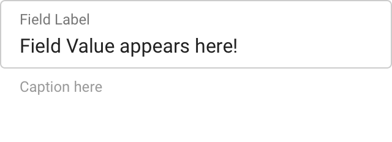

This field includes a caption inside the field. This type of field is used when the value needs qualifying data such as measurements, units, etc. 

Examples include: a field where the user enters weight (the caption will show “pounds” or “kilograms”), a field where the user enters a distance (the caption will show “feet”, “meters”, “kilometers”, etc).

#### Field with icon

This field includes an internal icon. The icon can be used to identify the field, but it is most often uses as an actionable button that will give the user more information–like a help icon that gives the user additional tips on what data to enter into the field.

#### Field with color picker

The Color Picker is a special text field that displays a color swatch along its right edge. This field allows users to enter a text value for color, or click the swatch to display a color picker modal.

### Text Field States
Text fields can have many states, all of which have a distinct visual appearance:

#### Placeholder

No value has been entered into the field. The field displays helper text that guides the user to the proper action on the field.

#### Active Field

The user has placed focus on this field (by selecting it or entering text into the field). The outline and label color  helps users identify the field that will take their input.

#### Field with Value

Form fields with values entered by the user will show the value in a more prominent text color (to differentiate them from placeholder and error states).

#### Field with Error

Fields that have failed validation show an error state. The field’s label, outline and value will be shown in the error color (default error color is red).

#### Multi-line text fields
Multi-line text fields are variants of text fields that allow the user to enter long form text. Multi-line fields are generally taller than standard text fields, and can include a scrollbar on their secondary vertical edge (right edge on LTR languages).

### Dropdowns / Selection fields

Dropdowns allow users to select from a predefined list of options. Dropdowns are useful when a large number of options are available to the user. Their appearance and states follow those shown in Text Fields.

#### Dropdown States

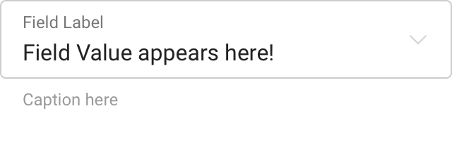

### Radio buttons

Radio buttons allow users to choose from a small number of predefined options. Radio buttons are used when a small number of options are available. They have the advantage of exposing all the options to the user (they do not require another click to expose the list of options)

### Checkboxes / Switches

Checkboxes allow users to enable or disable a single option. Checkboxes in the Epochtalk Design System are rendered as “switches” 

## Tables

Tables are used to display larger data sets arranged in rows and columns. Tables consist of a title, column headers and data. A subtle horizontal line separates the header from the data.

To reduce visual clutter, white space is used to differentiate rows and columns (no visible lines between rows and columns).

Tables can also have optional actions–like data filtering controls. These actions will appear in the right-edge of the table’s title.

Columns can be sorted by clicking the column header.

Rows can have actions associated with them (delete, edit, etc). Actions will appear in the right-most column of the row.

## Tooltips
<video width="349" height="150" autoplay loop muted>
  <source src="./img/ux/tooltip.mp4" type="video/mp4">
  Your browser does not support the video tag.
</video> 

Tooltips are small text overlays that help users understand the context of a field, button or other element of the interface. Tooltips appear when the user hovers over the “i” icon next to an element.

## Action Bars (Button Groups)

Action Bars organize actions by grouping related actions together. Action Bars consist of a primary action (button in Primary state) and one or more secondary actions.

## Draggable Rows

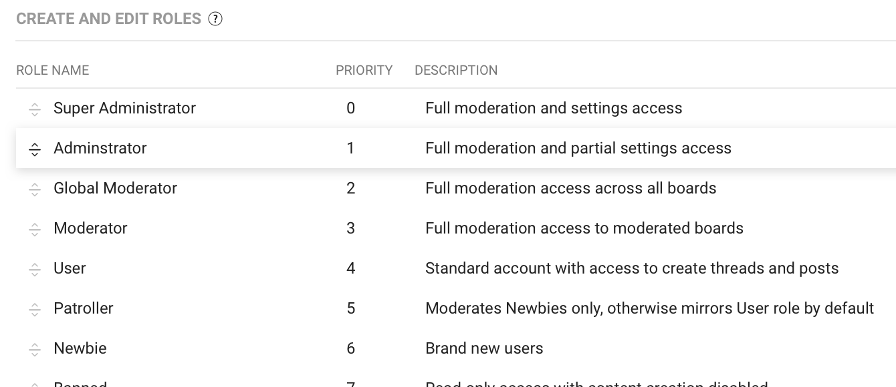
Drag rows are a special type of table row that allows data to be rearranged by clicking and dragging. Rows can be dragged to change order and priority. Rows can also be dragged to change the nesting (parent-child relationship) of rows.

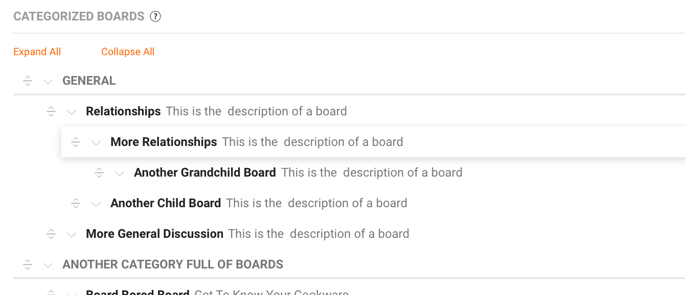

## Color Pickers
(will update with proper color picker support)

# Components

Organisms are larger elements formed by assembling the atoms and molecules.

## Navigation / menu bar
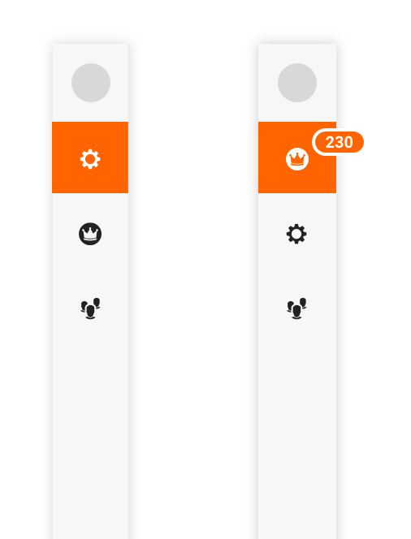

The Navigation Bar is a persistent vertical bar that appears  along the primary edge of a set of views. The bar contains the main navigation actions for the views. The Navigation Bar is fixed along the primary edge, remaining in the same position across all views, regardless of where the user has scrolled. This allows the user to easily navigate to each view.

Icons on the Navigation Bar show normal and active / selected states. The icon representing the current view is shown on a primary-colored background.

Icons can also show badges. The example above shows a badge representing the count of unread messages on the Moderation view.

## Panels
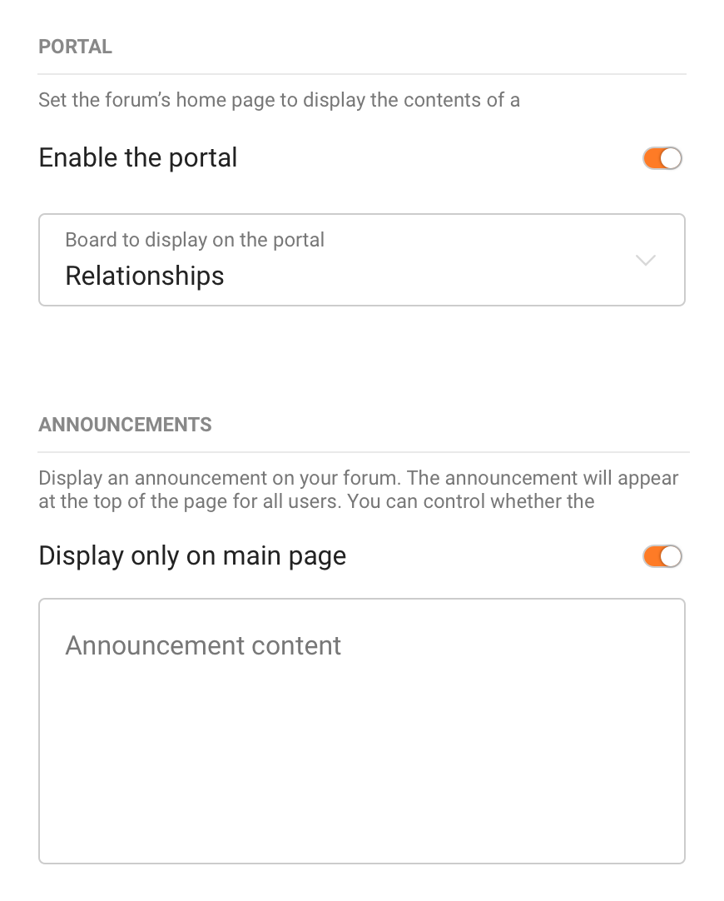
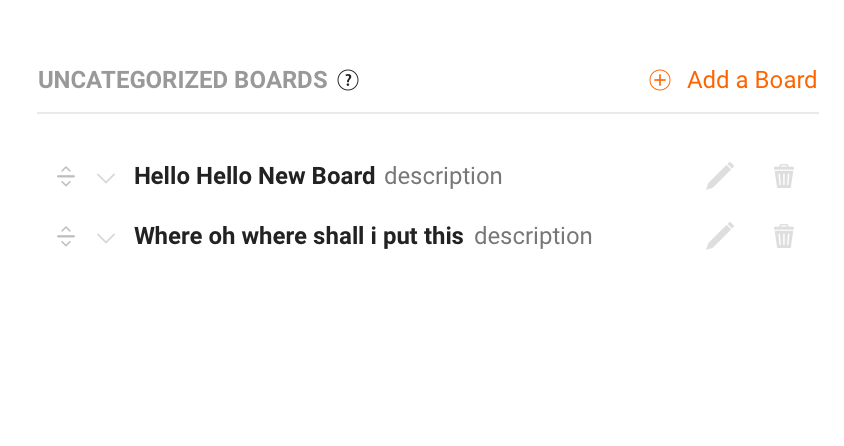

Panels are layout elements that contain interface elements. Panels can be used to group similar form fields, or a large table.

Panels consist of 
* the header with the panel’s title
* panel actions area which contains any actions that pertain to all the elements in the panel
* the panel body

## Modals
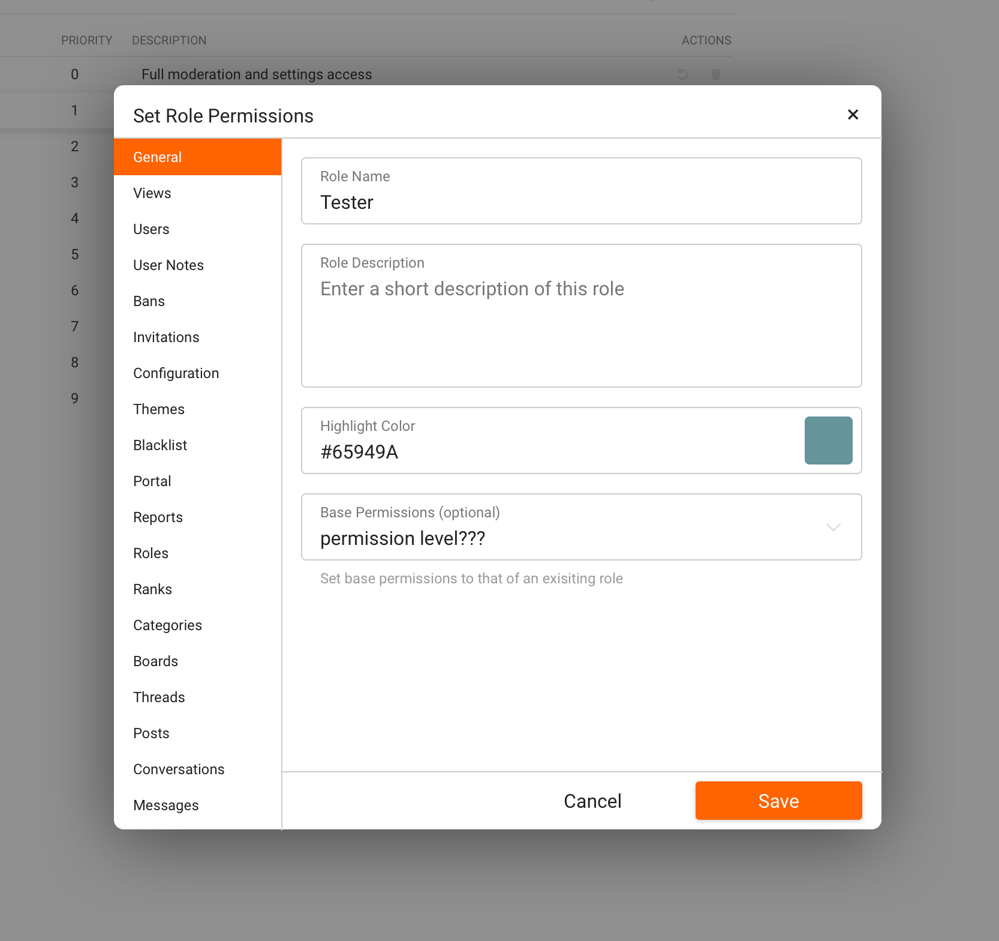

Modals are element containers that appear over the main views. Modals block interactions with the view behind the modal–users must finish using the modal and close it before interacting with the view in the background.

Modals can be simple message dialogs or complex groups of controls. All modals include the following:

* Header that includes the modal’s title and actions (“Close” button)
* Modal body that contains any message or controls
* Action Bar that contains the modal’s primary actions (“Cancel”, “Save”, etc)

## Pagination Controls

Pagination Controls allow the user to navigate through long threads. The Threads view’s default setting shows 25 replies per page. The Pagination Controls at the bottom of the view allow users to easily go to the next (or previous) page to view the more replies. Users can also jump directly to a specific page number.

The Pagination Controls are pinned to the bottom of the view so they are always easily accessible.

## Cards
<video width="667" height="388" autoplay loop muted>
  <source src="./img/components/cards.mp4" type="video/mp4">
  Your browser does not support the video tag.
</video> 

Cards group several info and interaction elements into a single, easy-to-scan element. Cards provide higher visibility to their content, making them good for elements that are new or important to the user.

## Collapsible tables / lists
<video width="786" height="386" autoplay loop muted>
  <source src="./img/components/collapsibleList.mp4" type="video/mp4">
  Your browser does not support the video tag.
</video> 

Collapsible lists allow users to condense long lists of elements. If some elements are less important to the user, they can choose to collapse them, reducing the number of items the user must look through while remaining easily accessible if needed.

## Error Message Bar
Error and warning messages are displayed in a bar at the bottom of the header. Along with the header, the Error Message Bar slides away when the user scrolls down, and reappears in the fixed position at the top of the view when the user scrolls up. This ensures that the error messages are easily visible. 

## Post Editor
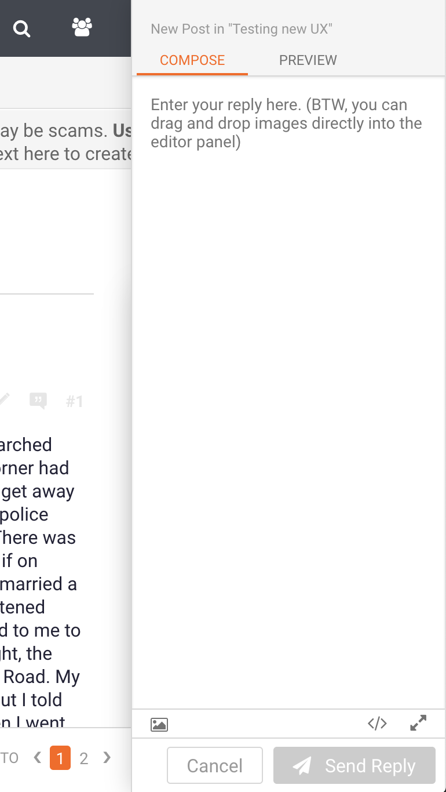

The Post Editor allows users to compose posts and replies. The Post Editor is opened by clicking the “Post Reply” button in the Actions Bar at the bottom of the Threads view.

The Post Editor appears pinned to the right edge of the Threads view. The Editor consists of several components:

Header with tabs for “Compose” and “Preview”
Editor body where users can enter their post text in Markdown
Secondary actions bar with buttons for inserting images, viewing Markdown formatting tips, and expanding the editor to full-screen
Primary actions bar with buttons to “Cancel” or “Send Reply” to the thread

Users can still interact with the Threads view behind the editor. This allows users to scroll through and quote posts while the editor is still open. The Post Editor sits over the Thread view’s sidebar, which blocks any Thread actions and the Poll–neither of which are used when composing a Post.

## Polls
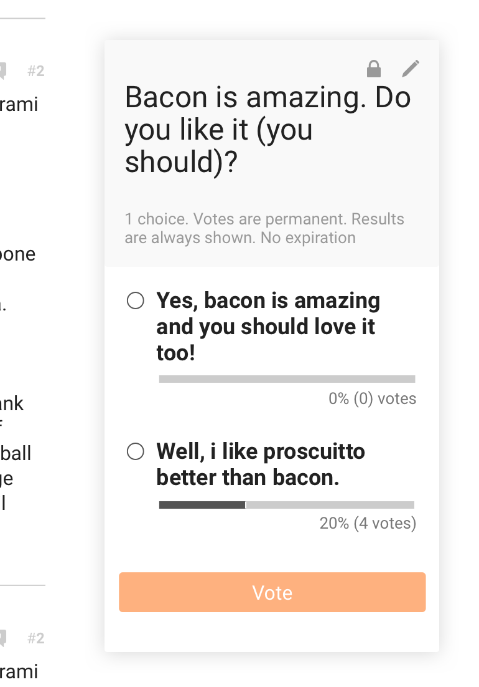

Polls can be added to Threads to get feedback from users. Polls appear along the right edge of the Threads view, below the actions bar. By default, 
* A user can select 1 answer 
* The Poll component shows the current results after voting
* Users cannot change their answer

All of the default settings can be changed by the poll creator.

### Poll Editor
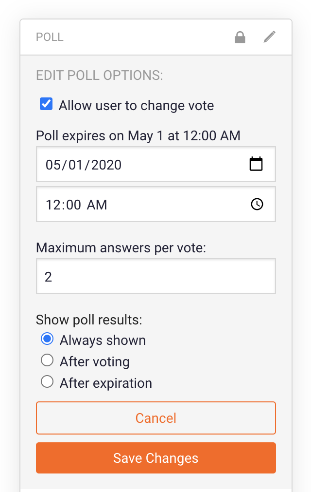

When a poll is created or edited, the user has the following options:

* Allow user to change vote
* Poll expiration date (no expiration or specific date and time)
* Maximum answers per poll
* When to show poll results

# Views
Pages are collections of Organisms and other components.
Templates

Page have several layout variations:

* Full width - content spans the entire width of the view
* 2-column with left bias - the Page is split into 2 columns, with the main (left) column using 75% of the width, and the sidebar (right) column using 25%.
* 2-column even split - the Page is split into 2 columns of even width

## Admin Views
* Moderation
* Management
* Settings

## Forum User Views
* Dashboard
* Board
* Thread
* User Profile
* Settings
